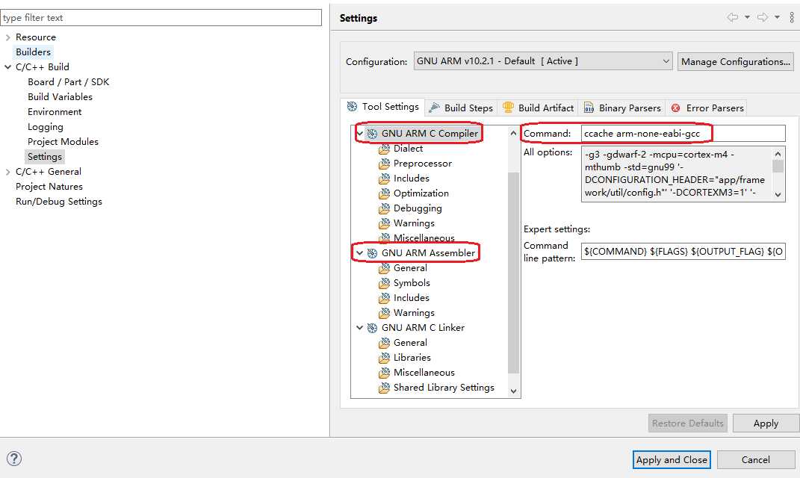

# 1. ccache 简介
**ccache**是`compiler cache`的缩写，官网 https://ccache.dev/ 。其主要原理是将编译过的文件缓存在文件系统中。后续编译的时候，优先从cache中查找内容一致的文件，如果命中，就直接使用相应的目标文件。对于Simplicity Studio这样大部分情况都是编译SDK的场景，非常有用。第一次发现这个东西的时候，如获至宝。  

<br>

# 2. 安装
从 https://ccache.dev/download.html 这里下载编译好的windows版本的二进制文件，解压，然后将路径加入了`path`环境变量中。

在cmd窗口中，输入`ccache --version`命令来测试一下路径是否添加好。
```powershell
PS C:\Users\Administrator> ccache --version
ccache version 4.2.1

Copyright (C) 2002-2007 Andrew Tridgell
Copyright (C) 2009-2021 Joel Rosdahl and other contributors

See <https://ccache.dev/credits.html> for a complete list of contributors.

This program is free software; you can redistribute it and/or modify it under
the terms of the GNU General Public License as published by the Free Software
Foundation; either version 3 of the License, or (at your option) any later
version.
```

安装好以后，无需额外的配置，直接使用默认的配置即可。默认的cache大小可以达到5GB。

建议将cache设置到SSD上面，提高效率。

Linux系统和macOS上面的安装方法请自行google。

这个工具对于IAR的支持情况未知，感兴趣的可以自己测试一下。

<br>

# 3. 配置Simplicity Studio的GCC工具链
目前比较遗憾的是Simplicity Studio创建的工程，并没有选项可以把ccache集成进来，只能在创建工程之后，修改工程属性来实现。
具体步骤在工程属性中，将compiler以及assembler的命令前面加上`ccache`。

<div align="center">
	
</div>

# 4. 测试结果
以下测试是以ZigbeeMinimal这个例程，从clean开始的编译时间统计。

场景 | 条件 | 编译时间
-:|-:|-:
第一次编译|不带ccache|4m:46s.455ms
第二次编译|不带ccache|4m:2s.870ms
第一次编译|带ccache|5m:24s.591ms
第二次编译|带ccache|2m:53s.816ms

可以看到，使用ccache之后，第一次编译的时间有所增加，但是后面编译的时间大大减少。


